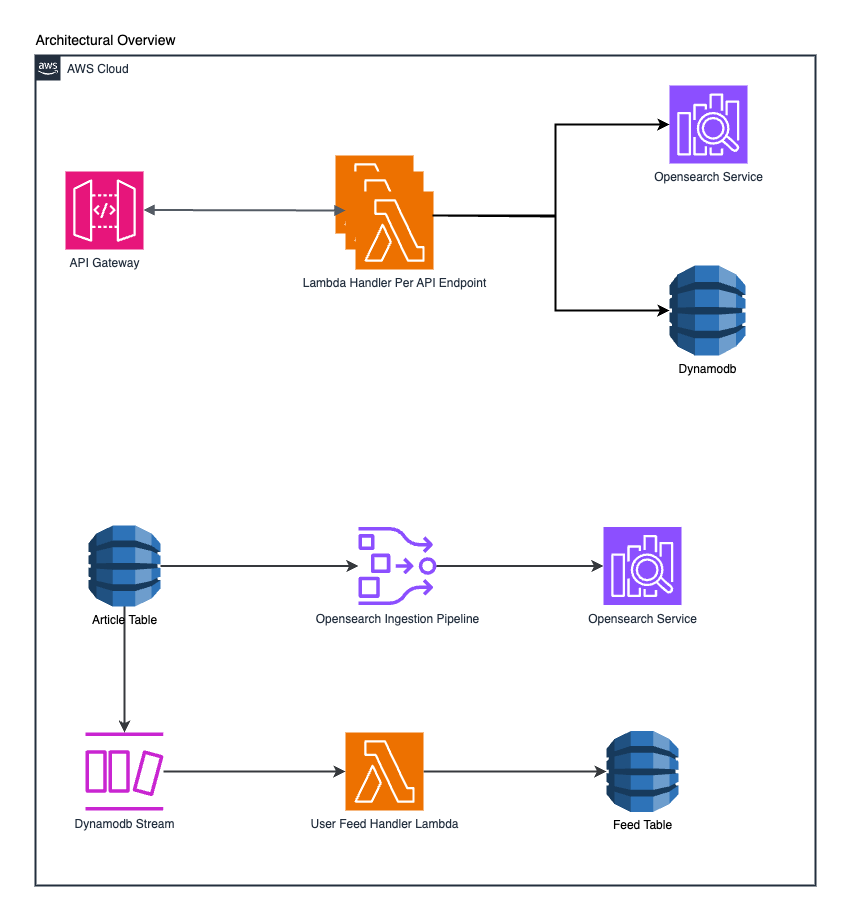
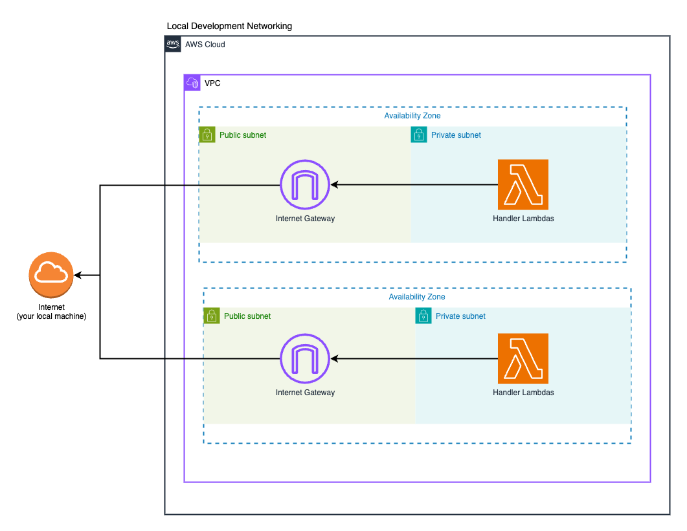
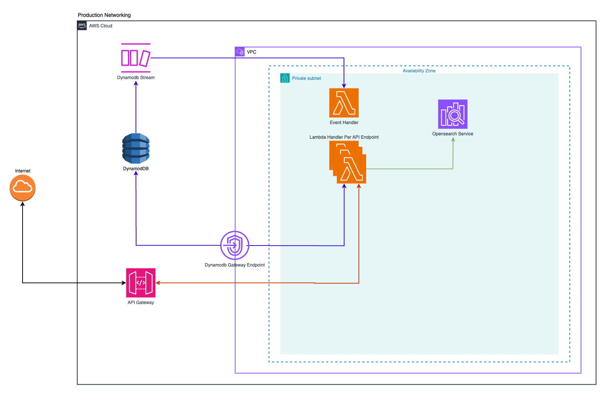

### Golang + SST + Lambda + DynamoDB + OpenSearch codebase containing real world examples (CRUD, auth, advanced patterns, etc) that adheres to the [RealWorld](https://github.com/gothinkster/realworld) spec and API.

This codebase was created to demonstrate a backend application built with **Golang + SST + Lambda + DynamoDB + OpenSearch** including CRUD operations, authentication, routing, pagination, and more.

For more information on how this works with other frontends/backends, head over to the [RealWorld](https://github.com/gothinkster/realworld) repo.

## Architecture

### Overview


#### API Flow
1. **API Gateway**
   - Entry point for all API requests

2. **Lambda Functions**
   - Separate handler for each API endpoint which implements business logic for specific operations

3. **DynamoDB**
   - Primary database for storing user, articles and comments

4. **OpenSearch Service**
   - Used for global queries such as most recent articles and list tags operations.

#### Event Flow
1. **OpenSearch Ingestion Pipeline**
   - Processes article updates from DynamoDB Streams and indexes them in OpenSearch

2. **User Feed System**
   - DynamoDB Streams capture article changes
   - Feed Handler Lambda processes these changes and updates user feeds in real-time in Feed Table


### Local Development



During local development, it's required that lambda functions can connect to the internet 
so that SST Live Lambda can communicate with your local machine. 
Therefore, in local development setup, we also deploy Internet Gateway (not required in production) to give Lambda functions access to the internet.
See https://docs.sst.dev/live-lambda-development for more details about SST Live Lambda.

### Production Networking

> Production Networking setup is NOT implemented yet. 
> I just need to deploy resources to different subnets and configure security groups accordingly depending on the stage that's all.
> I still wanted to share how the production networking diagram would look like.



## Project Structure

```
.
├── cmd/                                  
│   └── functions/                        # API endpoint per Lambda function and event handlers
│       ├── add_comment/                  
│       ├── delete_article/               
│       ├── delete_comment/               
│       ├── favorite_article/             
│       ├── follow_user/                  
│       ├── get_article/                  
│       ├── get_article_comments/         
│       ├── get_current_user/             
│       ├── get_tags/                     
│       ├── get_user_feed/                
│       ├── get_user_profile/             
│       ├── list_articles/                
│       ├── login_user/                   
│       ├── post_article/                 
│       ├── register_user/                
│       ├── swagger/                      
│       ├── unfavorite_article/           
│       ├── unfollow_user/                
│       ├── update_article/               
│       ├── update_user/                  
│       └── user_feed/                    
├── internal/                             # Internal packages
│   ├── api/                              # API layer
│   │   ├── openapi/                      # OpenAPI/Swagger specifications
│   │   ├── article_api.go                
│   │   ├── comment_api.go                
│   │   ├── feed_api.go                   
│   │   ├── profile_api.go                
│   │   ├── user_api.go                   
│   │   ├── middleware.go                 # HTTP middleware (auth, logging)
│   │   ├── pagination.go                 # Pagination utilities
│   │   ├── request_helpers.go            # Request parsing and validation
│   │   └── response_helpers.go           # Response utilities
│   ├── database/                         # DynamoDB and OpenSearch clients
│   │   ├── dynamodb.go                   
│   │   └── opensearch.go                 
│   ├── errutil/                          # Error handling types and utilities
│   │   └── error.go                      
│   ├── repository/                       # Data access layer
│   │   ├── article_repository.go         
│   │   ├── comment_repository.go         
│   │   ├── feed_repository.go            
│   │   ├── follower_repository.go        
│   │   ├── user_repository.go            
│   │   └── mocks/                        # Repository mocks for testing
│   ├── security/                         # Security utilities
│   │   ├── auth.go                       # Authentication helpers for net/http
│   │   └── jwt.go                        # JWT token handling
│   ├── service/                          # Business logic layer
│   │   ├── article_service.go            
│   │   ├── article_list_service.go       
│   │   ├── comment_service.go            
│   │   ├── feed_service.go               
│   │   ├── profile_service.go            
│   │   ├── user_service.go               
│   │   └── mocks/                        # Service mocks for testing
│   └── test/                             # Testing utilities and entity helpers to support E2E tests
│       ├── article_entity_helper.go      
│       ├── auth_test_suite.go            
│       ├── comment_entity_helper.go      
│       ├── helpers.go                    
│       └── user_entity_helper.go         
├── stacks/                               # SST Infrastructure
│   ├── APIStack.ts                       # API Gateway and Lambda config
│   ├── DynamoDBStack.ts                  # DynamoDB tables and indexes
│   ├── OpenSearchStack.ts                # OpenSearch configuration
│   └── VPCStack.ts                       # VPC and network config
├── tools/                                # Development tools
│   └── jwt/                              # JWT key generation for local development
│   └── openapi/                          # OpenAPI specs generation
├── go.mod                                
├── Makefile                              # Build and development commands
├── package.json                          
├── sst.config.ts                         # SST configuration
└── tsconfig.json                         
```

### Internal Package Details

#### API Layer (`internal/api/`)
- OpenAPI/Swagger specifications for API documentation
- Request/response handling and validation
- Middleware for authentication, logging, and error handling
- Endpoint implementations for articles, comments, users, and profiles
- Pagination utilities for list endpoints

#### Database Layer (`internal/database/`)
- DynamoDB and OpenSearch client used by repository layer

#### Repository Layer (`internal/repository/`)
- Implementation of data access patterns for domain models
- DynamoDB and OpenSearch database models and mapping between database and domain models
- Mock implementations for testing

#### Service Layer (`internal/service/`)
- Core business logic implementation
- User profile and authentication logic
- Article&Comment management and operations
- Feed generation and filtering

#### Security Layer (`internal/security/`)
- JWT token generation and validation
- Authentication utilities
- Password hashing and verification

#### Testing Utilities (`internal/test/`)
- Test helpers and fixtures
- Common test suite setup

Each Lambda function in the `cmd/functions` directory contains the following files:
- `[function_name].go` - Main handler code for API endpoint or event handler
- `[function_name]_test.go` - E2E tests for the Lambda function

The `internal` packages contain the following subdirectories:
- `domain` - Business entities and interfaces
- `repository` - Data access implementation
- `service` - Business logic implementation
- `api` - HTTP request handling
